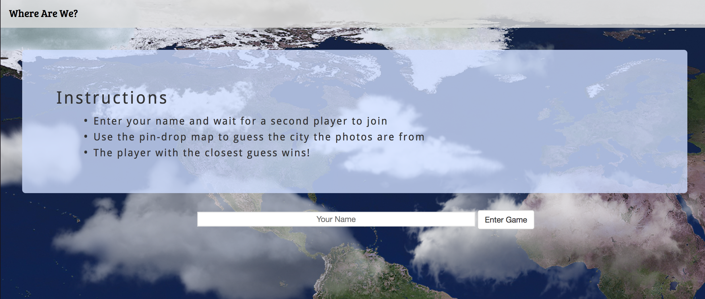
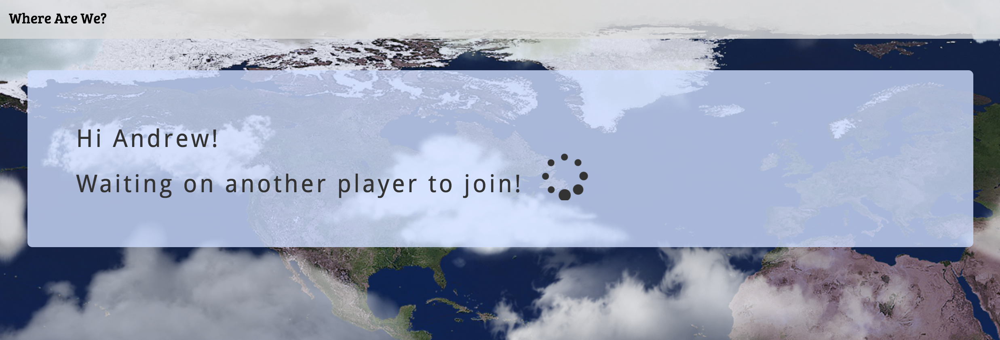
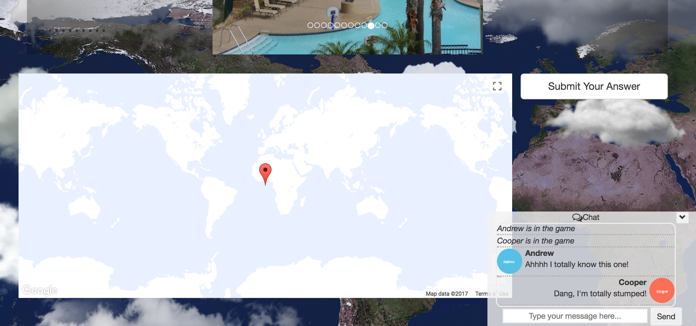
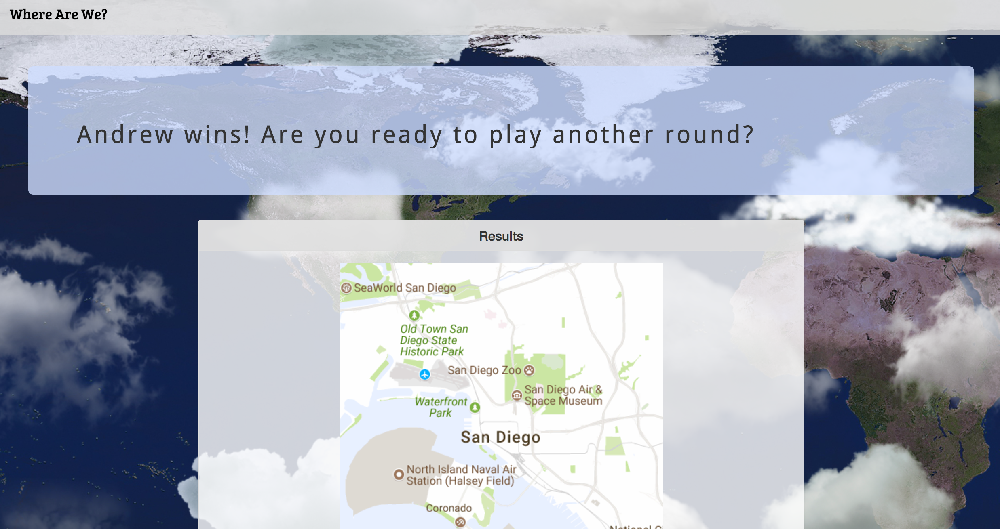
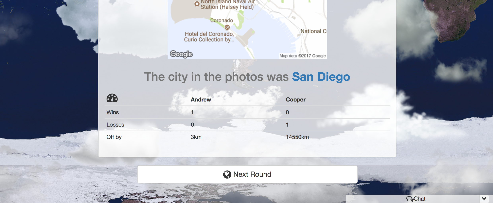

# Where Are We?

This is a two-player game that tests understanding of geography and players' ability to infer from context clues. We wanted to create a game that would expose players to a different view of cities across the world, promote an interest in exploration, and serve as an educational tool.

Once two players have joined, images are displayed of a city somewhere in the world. The players have to guess what city the photos are from and try to move the map pin as close to the location as they can. The user with the closest guess wins.

[Check out this app on GitHub Pages](https://ruigrok.github.io/where-are-we/ "Where Are We? on GitHub Pages")

---

## Technologies Used

### Firebase & jQuery
This is a single-page application. [Firebase](https://firebase.google.com/ "Google Firebase Homepage") allows us to initiate the game when two players are present. It also allows us to update the display the players see based on whether or not it's their turn and based on what stage they are in the game play. All DOM maniuplations are performed with jQuery Firebase keeps track of the players guesses, their turn, and their cummulative win/loss record. 

Firebase is also used for the real-time chat feature. For added fun, we pass all messages through the [Yoda Speak API](https://market.mashape.com/ismaelc/yoda-speak "Yoda Speak on Mashape").

### Google Maps Javascript API

1. After a random city is chosen from the pre-loaded options in our citiesData.js file, we use Google Maps to generate a map of the world with a draggable marker with the default location of lat: 0, lng: 0. We disabled the map description features to increase difficulty and used a [Snazzy Maps](https://snazzymaps.com/ "Snazzy Maps Homepage") styled map object to make the map more visually appealing.

2. For displaying photos, we make a call to The Google Places API Web Service. We request a "Nearby Search" and receive back user-submitted content from within 5km of the city center. We then use a callback function to grab only the photos from the returned data, and push these images into an array that is used to render the photos in an image carousel.

3. When a player drags the marker, we use the Google Maps geometry library to compute the distance between the users guess and the location of the city.

4. On the results screen, a static map is generated to show users a view of the correct city answer.

### Landing Page

---

### Waiting for Player 2

---

### Google Places Photo Carousel

---
### Pin-Drop Map & Player Chat

---

### Correct City Display

---
### Results Display

---

